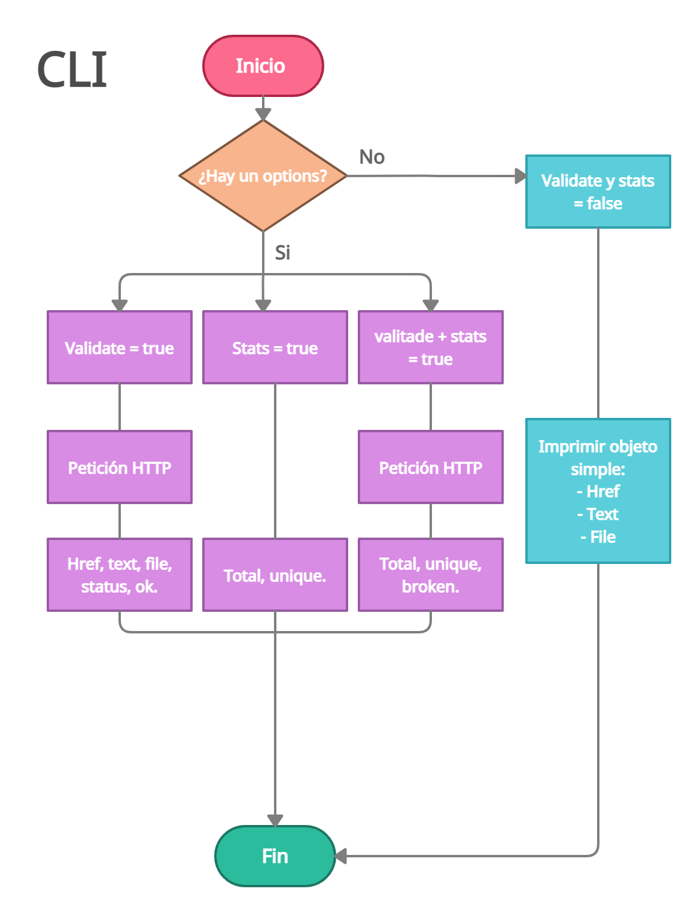

# MDLINKS
## INDICE:
[1. Preambulo:](#preambulo)  
[2. Poyecto:](#proyecto)  
[3. Guía de uso e istalación:](#guia-de-uso-e-instalacióm)  
[4. Autora:](#Autora)  
***
### Preambulo 🔥
Markdown es un lenguaje de marcado que facilita la aplicación de formato a un texto empleando una serie de caracteres de una forma especial. En principio, fue pensado para elaborar textos cuyo destino iba a ser la web con más rapidez y sencillez que si estuviésemos empleando directamente HTML. Y si bien ese suele ser el mejor uso que podemos darle, también podemos emplearlo para cualquier tipo de texto, independientemente de cual vaya a ser su destino.

En la actualidad existen editores de texto, servicios web y extensiones que hacen uso de Markdown y suele ser muy común encontrar varios archivos en ese formato en cualquier tipo de repositorio (empezando por el tradicional README.md).

Estos archivos Markdown usualmente contienen links que algunas veces están rotos, imcompletos lo que los convierte en links no válidos, perjudicando de esta manera el valor de la información que se desea compartir.

<code>**md-links**</code> es una herramienta que usa Node.js, para leer y analizar archivos en formato Markdown, para verificar los links que contengan y reportar algunas estadísticas.

### Proyecto 💻

- <code>**Diagrama de flujo API**</code>

 

- <code>**Diagrama de flujo CLI**</code>

  
***1. JavaScript API***  
Conjunto de módulos donde:
- **Api.js**, contiene funciones síncronas utilizando fibrerías nativas de node.js como <code>fileSystem</code> y <code>path</code> contiene paquetes npm como: <code>marked</code> para convertir el texto de un archivo markdown a elementos html y junto con el [custom renderer](https://marked.js.org/using_pro#renderer) se puede extraer las propiedades de un elemento ancla y <code>node-fetch</code> para realizar las peticiones y obtener el status de los links, ello en conjunto con la funcion recursiva traverseDirectoryFindFiles, se construye las bases de lo que sera nuestra funcion mdLinks.
- **mdLinks.js**,contiene la funcion mdLinks como tal y que retornará una promesa en estado pending y que consumiremos más adelante...

***2. CLI (Command Line Interface - Interfaz de Línea de Comando)***  
Aquí hemos divido el proceso en 2 modulos: 
- **options.js**, posee pequeñas funciones donde obtiene un reporte de los links totales que existen en un archivo markdown, además de un conteo de los links unicos, links rotos y links ok. Como un plus contienen constantes con template strings que albergan arte ascii para personalizar los rejects del consumo de la funcion mdLinks.
- **cli.js**, posee el metodo de process.argv de node para poder capturar el input del usuario y luego una serie de condicionales para ver por consola el consumo de la promesa.

Esta librería esta hecha en node.js en conjunto con CommonJS Modules, es decir, se implemento <code>require/module.exports</code>  

### Guía de uso e instalación 📄
Esta librería puedes instalarla desde [npm](https://www.npmjs.com/package/andu15-mdlinks) o desde [github](https://github.com/Andu15/LIM015-md-links)

##### Instalación por npm
`$ npm install lisy13-mdlinks`  

`$ npm i andu15-mdlinks`
##### Instalación por github

`$ npm install lisy13/LIM015-md-links`
##### Usabilidad

`const mdLinks = require('lisy13-mdlinks');`

Esta aplicación debe poder ejecutarse de la siguiente manera a través de la terminal:  

          md-links <path> [options]

  **Opciones de ejecución y ejemplos de retornos**

  - **Cuando no ingresas una ruta o ingresas una ruta incorrecta**

| `md-links`  ó  `md-links estoNoEsUnaRuta` |
|-------------------|
|   |

  - **Cuando ingresas una ruta de un archivo que no sea .md o carpeta que no tenga archivos.md**

|`md-links ../LIM015-md-links/src/prueba/hola.txt` |
|----------------------------|
|    |

  - **Cuando ingresas una ruta de un archivo markdown que no posee links**

|`md-links ../LIM015-md-links/src/prueba/pruebaDos/hola.md` |
|----------------------------|
|    |

  -**Cuando ingresas el comando --help** 

|`md-links --help`  ó  `md-links ../LIM015-md-links/src/prueba/pruebaDos/hola.md --help` |
|----------------------------|
|    |

  - **Cuando ingresas la ruta sin un option**

|`md-links ../LIM015-md-links/src/prueba/pepito.md` |
|----------------------------|
           [
      {
        href: 'https://www.tabnine.com/code/javascript/functions/marked/Renderer',
        text: 'marked',
        file: '../LIM015-md-links/src/prueba/pepito.md'
      },
      {
        href: 'https://markjs.io/123',
        text: 'mark.js',
        file: '../LIM015-md-links/src/prueba/pepito.md'
      }
    ];

  - **Cuando ingreses una ruta y luego el comando --validate**

|`md-links ../LIM015-md-links/src/prueba/pepito.md --validate` |
|----------------------------|
          [
      {
        href: 'https://www.tabnine.com/code/javascript/functions/marked/Renderer',
        text: 'marked',
        file: '../LIM015-md-links/src/prueba/pepito.md',
        status: 200,
        message: 'ok'
      },
      {
        href: 'https://markjs.io/123',
        text: 'mark.js',
        file: '../LIM015-md-links/src/prueba/pepito.md',
        status: 404,
        message: 'fail'
      }
    ];

  - **Cuando ingreses una ruta y luego el comando --stats**  

|`md-links ../LIM015-md-links/src/prueba/pepito.md  --stats` |
|----------------------------|
          Total: 2
          Unique: 2

  - **Cuando ingreses una ruta y luego los comandos --validate --stats**

|`$ md-links lib/mdlinks.md --validate --stats` |
|----------------------------|
          Total: 2
          Unique: 2
          Broken: 1

### Autora ✍

🅽🅾🅴🅻🅸🆂 🅷🅴🆁🅽🅰🅽🅳🅴🆉 🅳🅰 🅶🆁🅰🅲🅰

[GitHub Noelis](https://github.com/noelishernandezdg)

* ___Inicio del proyecto:___ 08/09/2021  
* ___Fin del proyecto:___ 7/10/2021